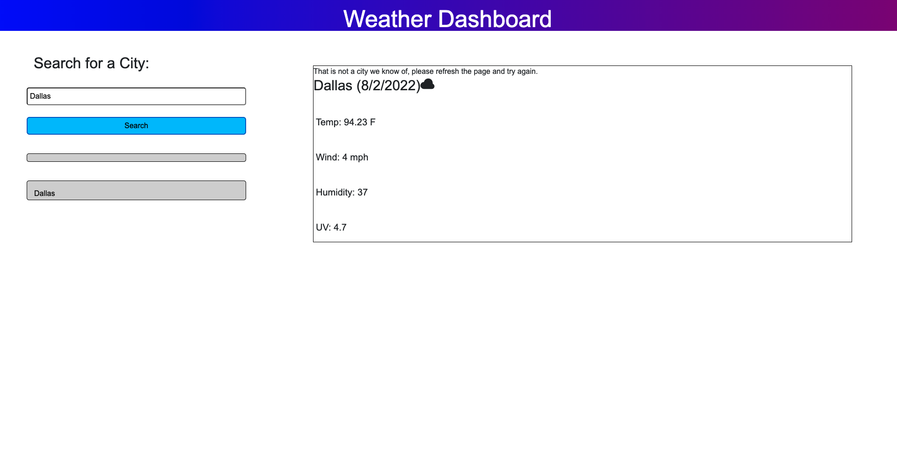

# programming-quiz

## Description

This is a webpage that allows the user to take inquire about current weather conditions in their city

- User is prompted with a screen that gives them the option submit a specific city
- upon submiting their city they are presented with the cities current weather conditions
- upon submitting a new city name, their previous search is saved in a lsit and they are given new information

## Tasks Completed

- created a stylized webpage with html and css
- connected an api that takes user input as a parameter and returns targeted informated in dynamic html elements
-

## Usage

To view the project follow the link attached to be taken to the live url.

- Url: [https://t-rummy.github.io/weather-app/] (https://t-rummy.github.io/weather-app/)

-  Github Repository: [https://github.com/T-rummy/weather-app](https://github.com/T-rummy/weather-app)

## Credits

- [https://coding-boot-camp.github.io/full-stack/github/professional-readme-guide](https://coding-boot-camp.github.io/full-stack/github/professional-readme-guide)

## Screenshot 

 